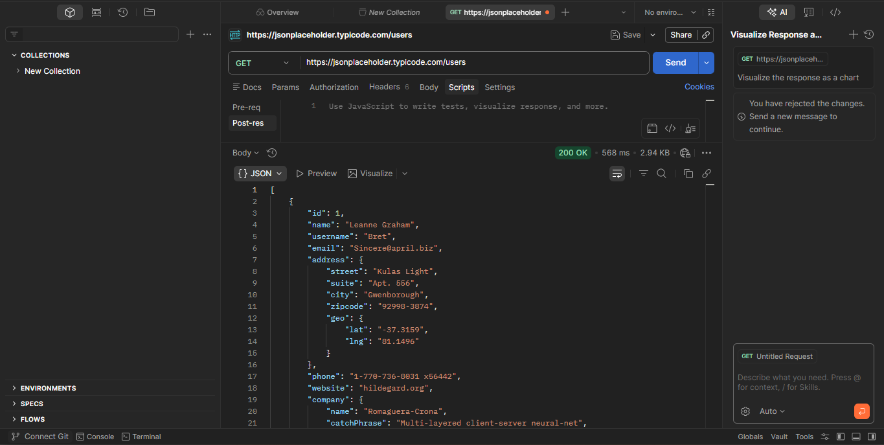
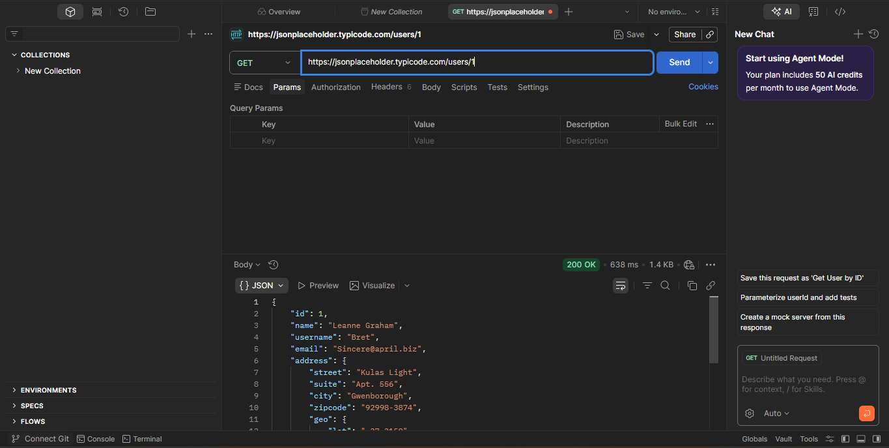
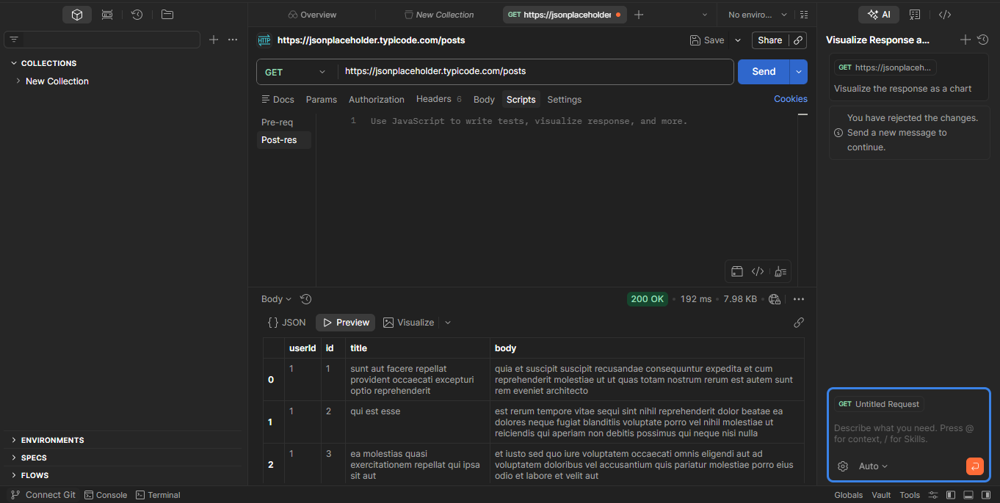
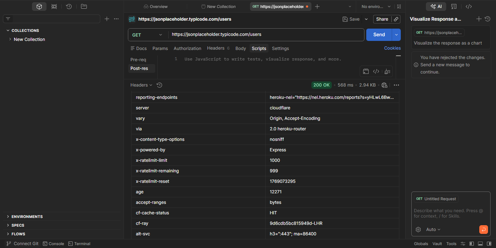

# API-Security-Analysis

---

## Table of Contents
1. [Introduction](#introduction)
   
2. [Objectives](#objectives)
   
3. [Tools Used](#tools-used)
   
4. [API Endpoints Tested](#api-endpoints-tested)
   
5. [Findings / Vulnerabilities](#findings--vulnerabilities)
    
    - [1. Unauthenticated Access](#1-unauthenticated-access)
      
    - [2. Broken Object Level Authorization (BOLA)](#2-broken-object-level-authorization-bola)
      
    - [3. Excessive Data Exposure](#3-excessive-data-exposure)
      
    - [4. Missing Security Headers](#4-missing-security-headers)
    
6. [Conclusion & Recommendations](#conclusion--recommendations)
    
7. [References](#references)

---

## Introduction
This project demonstrates an API security analysis performed on a public test API: [JSONPlaceholder](https://jsonplaceholder.typicode.com).  
The analysis focuses on common vulnerabilities, including unauthenticated access, broken object level authorization (BOLA), excessive data exposure, and missing security headers.

---

## Objectives

- Identify security weaknesses in public API endpoints
  
- Analyze data exposure and access controls
  
- Document findings with evidence
  
- Recommend remediation for each vulnerability

---

## Tools Used

- **Postman (Web Version)** – for sending requests and inspecting responses
  
- **Google Docs** – for drafting notes and findings
  
- **Screenshots** – for visual evidence of vulnerabilities

--- 

## API Endpoints Tested

| Endpoint | Method | Purpose |
|----------|--------|---------|
| `/users` | GET | Retrieve all users |
| `/users/{id}` | GET | Retrieve individual user by ID |
| `/posts` | GET | Retrieve all posts |
| `/posts?userId={id}` | GET | Retrieve posts filtered by user |

---

## Findings / Vulnerabilities

### 1. Unauthenticated Access

- **Observation:** API endpoints are publicly accessible without authentication.
  
- **Risk:** Anyone can retrieve sensitive user information without logging in.
  
**Evidence:**

  
  
- **Severity:** Medium (would be High in a real production environment)

### 2. Broken Object Level Authorization (BOLA)

- **Observation:** Changing user IDs (`/users/1` → `/users/2`) allows access to other users’ data.
  
- **Risk:** Attackers could enumerate all users and access personal information.
  
**Evidence:**
  

  
- **Severity:** High

### 3. Excessive Data Exposure

- **Observation:** `/posts` endpoint returns ~100 records at once.
  
- **Risk:** Bulk data exposure allows profiling, large-scale scraping, and collection of sensitive information.
  
**Evidence:**

  
- **Severity:** Medium

### 4. Missing Security Headers

- **Observation:** Only `X-Content-Type-Options` is present; recommended headers like `Strict-Transport-Security`, `Content-Security-Policy`, and `X-Frame-Options` are missing.
  
- **Risk:** Missing headers weaken client-side security and could allow certain browser-based attacks.
  
**Evidence:** 

  
- **Severity:** Low

---

## Conclusion & Recommendations

- Implement authentication (API keys or OAuth) for sensitive endpoints.
  
- Enforce object-level authorization for `/users/{id}` endpoints.  
- Apply pagination or limit results for bulk endpoints to prevent excessive data exposure.
  
- Add recommended security headers:
  
  - `Strict-Transport-Security`
    
  - `Content-Security-Policy`
    
  - `X-Frame-Options`
    
- Regularly review API endpoints for compliance with security best practices.

---

## References

- [OWASP API Security Top 10](https://owasp.org/www-project-api-security/)
  
- [JSONPlaceholder Public API](https://jsonplaceholder.typicode.com)
